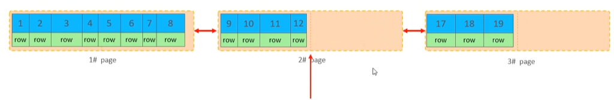
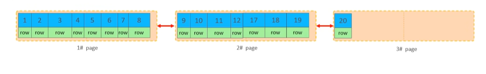
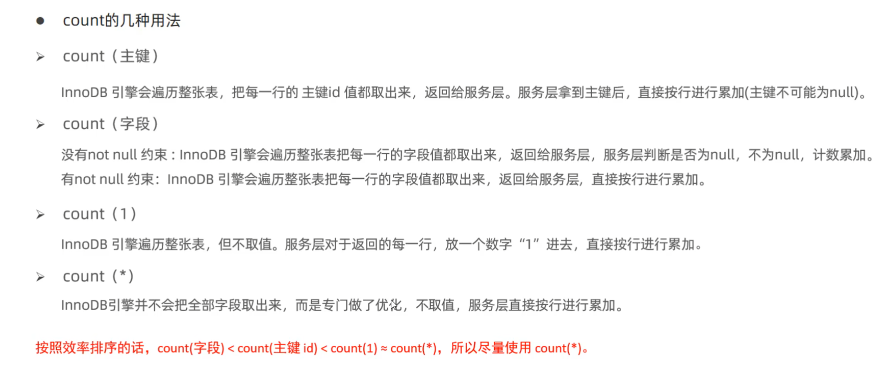
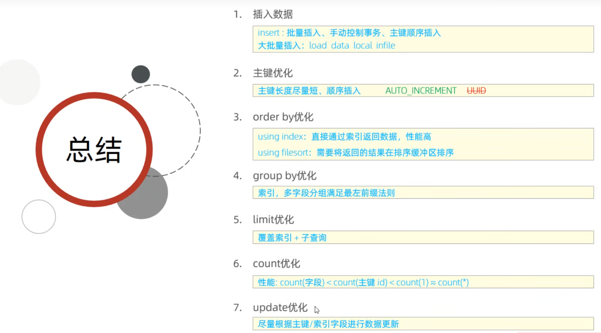
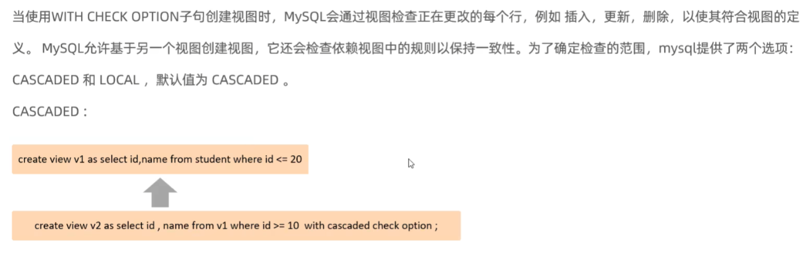

# 3_3

## SQL优化

### 插入数据

- insert优化
不建议一次性插入1000条数据
- 手动提交事务

  ```sql
  start transaction;
  insert ...
  insert ...
  ...
  commit;
  ```

- 主键顺序插入
  取决于MySQL的数据组织结构

- 大批量插入数据
  需要使用load指令
  1. 客户端连接服务端时，加上参数--local-infile

      ```sql
      mysql --local-infile -u root -p
      ```

  2. 设置全局参数local_infile为1，开启从本地加载文件导入数据的开关

      ```sql
      //查看这个开关是否开启
      select @@local_infile;
      //打开开关
      set global local_infile = 1;
      ```

  3. 执行load指令将准备好的数据，加载到表结构中

      ```sql
      load data local infile '/root/sql1.log' into table 'tb_user' fields terminated by ',' lines terminated by '/n';
      ```

### 主键优化

- 数据组织方式
在InnoDB存储引擎中，表数据都是根据主键顺序组织存放的，这种存储方式的表称为==索引组织表==(index organized table ==IOT==)。

- 页分裂
页可以为空，也可以填充一半，也可以填充100%。每个页包含了2~N行数据（如果一行数据太大，会行溢出），根据主键排列。


- 页合并
当删除一行记录时，实际上记录并没有被物理删除，至少记录被标记（flaged）为删除并且它的空间变得允许被其他记录声明使用。
当页中删除的记录达到==MERGE_THRESHOLD==(默认为页的50%)，InnoDB会开始寻找最靠近的页（前或后）看看是否可以将两个页合并并以优化空间使用。

  >MERGE_THRESHOLD可以自己设置，在创建表或者创建索引时指定。





- 主键的设计原则

  - 满足业务需求的情况下，尽量降低主键的长度。
  - 插入数据时，尽量选择顺序插入，选择使用AUTO_INCREMENT自增主键。
  - 尽量不要使用UUID(通用唯一标识符（Universally Unique Identifier）)做主键，如身份证号。
  - 业务操作时，避免对主键的修改。

### order by 优化

1. **Using filesort**：通过表的索引或全表扫描，读取满足条件的数据行，然后在排序缓冲区sort buffer完成排序操作，所以不是通过索引直接返回排序结果的排序都叫FileSort排序。
2. **Using index**：通过有序索引顺序扫描直接返回有序数据，这种情况即为using index，不需要额外排序，操作效率高。

- 没有创建索引时，根据age，phone进行排序
  
  ```sql
  explain select id,age,phone from tb_user order by age,phone;
  ```

- 创建索引后，根据age，phone进行升序排序

  ```SQL
  explain selectt id,age,phone from tb_user order by age, phone;
  ```

- 创建索引后，根据age，phone进行降序排序

  ```SQL
  explain selectt id,age,phone from tb_user order by age desc, phone desc;
  ```

- 根据age，phone进行一个升序，一个降序

  ```sql
  explain select id,age,phone from tb_user order by age asc,phone desc;
  ```

- 创建索引

  ```sql
  create index idx_user_age_ad on tb_user(age asc,phone desc);
  ```

>- 根据排序字段建立合适的索引，多字段排序时，也遵循最左前缀法则。
>- 尽量使用覆盖索引。
>- 多字段排序，一个升序一个降序，此时需要注意联合索引在创建时的规则（ASC/DESC）。
>- 如果不可避免出现filesort，大数据排序时，可以适当增大排序缓冲大小sort_buffer_size(默认256k)。

### group by优化

- 执行分组操作，根据profession字段分组
  
  ```sql
  explain select profession, count(*) from tb_user group by profession;
  ```

>- 在分组操作时，可以通过索引来提高效率。
>- 分组操作时，索引的使用也是满足最左前缀法则的。

### limit优化

- 分页查询的优化
  优化思路：一般分页查询时，通过创建，覆盖索引能够较好地提高性能，可以通过覆盖索引加子查询形式进行优化。

  ```SQL
  explain select * from tb_user t,(select id from tb_sku order by id limit 20000000,10) a where t.id = a.id;
  ```

### count优化

- count(主键)
- count(字段)
- count(数字)
- count(*)
  

### updata优化(避免行锁升级为表锁)

==InnoDB的行锁是针对索引加的锁，不是针对记录加的锁，并且该索引不能失效，否则会从行锁升级为表锁。==

### 总结



## 视图

### 介绍和基本语法

视图中并不存储数据，数据存储在基表当中

- 创建
  
  ```sql
  CREATE [OR REPLACE] VIEW 视图名称[(列表名称)] AS SELECT语句 [WITH[CASCADED|LOCAL]CHECK OPTION]
  ```

- 查询

  ```SQL
  //查看创建视图语句：SHOW CREATE VIEW 视图名称;
  //查看视图数据：SELECT * FROM 视图名称 ......;
  ```

- 修改
  
  ```sql
  方式一：CREATE [OR REPLACE] VIEW 视图名称[(列名列表)] AS SELECT语句 [WITH[CASCADED|LOCAL] CHECK OPTION]
  方式二：ALTER VIEW 视图名称[(列名列表)] AS SELECT语句 [WITH[CASCADED|LOCAL] CHECK OPTION]
  ```

- 删除

  ```SQL
  DROP VIEW [IF EXISTS] 视图名称 [,视图名称] ...
  ```

### 检查选项（cascaded）


